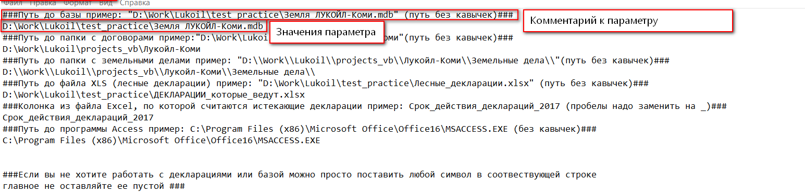

Установка и настройка программы
=============================================

Установка
----------------------------------------------

Для начала работы с программой вам необходимо просто скопировать папку 
с программой на свой компьютер. 

.. note:: Желательно, чтобы путь был без кириллицы.
    

Настройка программы
---------------------------------------------
Все доступные пользователю параметры находятся в файле **config/parameters.txt**

    Файл с параметрами

Каждый параметр сопровождается комментарием и примером заполнения (данная строка) начинается с символов **###**

.. warning:: При изменении значений параметров просьба обращать внимание на вид и количество слэшей ( \\ ), а также на наличие или отсутствие их в конце параметра

Описание всех параметров приведено ниже

1. **Путь до базы** -- место хранения базы "Земля" (локально или на сетевом диске)

    .. note:: Путь до папки на локальном или сетевом диске будут отличаться

2. **Путь до папки с договорами** -- Местоположение, в которой программа будет искать папку с договором аренды. Стоит отметить, что программа ищет папку и во вложенных папках, поэтому возможно указание директорий верхних уровней (**например, D:\\**). Чем "ближе" вы укажете папку, тем "быстрее" программа сработает. Соответственно, чем дальше -- тем "дольше".

3. **Путь до папки с земельными делами** -- Фиксированное местоположение, где расположена папка с земельными делами

4. **Путь до файла XLS** -- Путь до файла с лесными декларациями

5. **Колонка из файла Excel, по которой считаются истекающие декларации** -- Колонка файла XLS, в которой содержится дата истечения декларации

6. **Путь до программы Access** -- Директория установки программы Microsoft Access