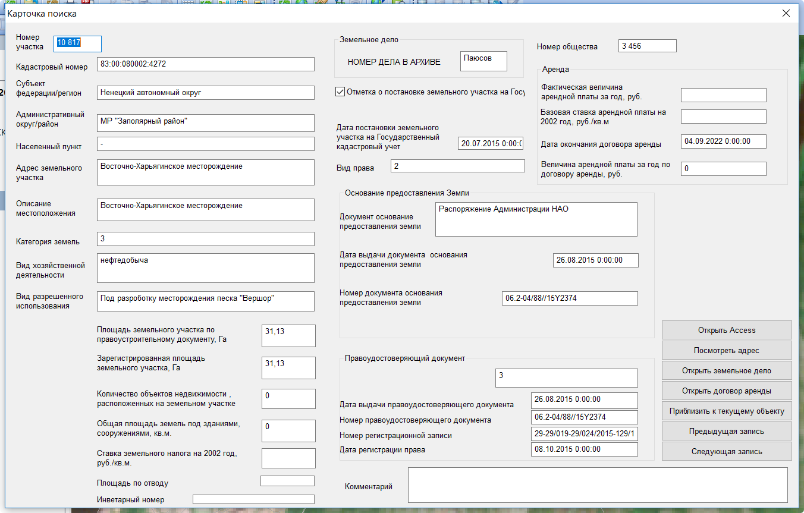

Работа с контекстным меню
================================================
Контекстное меню включает в себя три команды
    .. figure:: img/contextMenuCommand.png
        :align: center
        :name: Дополнительное контекстное меню
        :alt: Дополнительное контекстное меню

.. warning:: Выполняйте эти команды только когда объекты выбраны в слое **Месторождения**. Переход по этим командам при выбранных объектах из других слоев приведет к "вылету" программы

Открыть карточку поиска
-----------------------
С помощью этой команды можно открыть соотвествующую запись из базы Земля в виде формы

.. tip:: Если команда неактивна, то вы задали неправильный путь либо сознательно отключили работу с БД

По нажатию открывается следующая форма:

Открыть договор аренды
-----------------------
С помощью этой команды можно найти папку договора, которая соотвествует выбранному объекту. Если папка не найдена, то появится сообщение об ошибке, что папка не найдена.

.. note:: Поиск папок рекурсивный. После выполнения операции будут открыты все папки, которые удовлетворяют условиям поиска

Открыть земельное дело
-----------------------
С помощью этой команды можно найти папку с земельным делом, которая соотвествует выбранному объекту. Если папка не найдена, то появится сообщение об ошибке, что папка не найдена.
