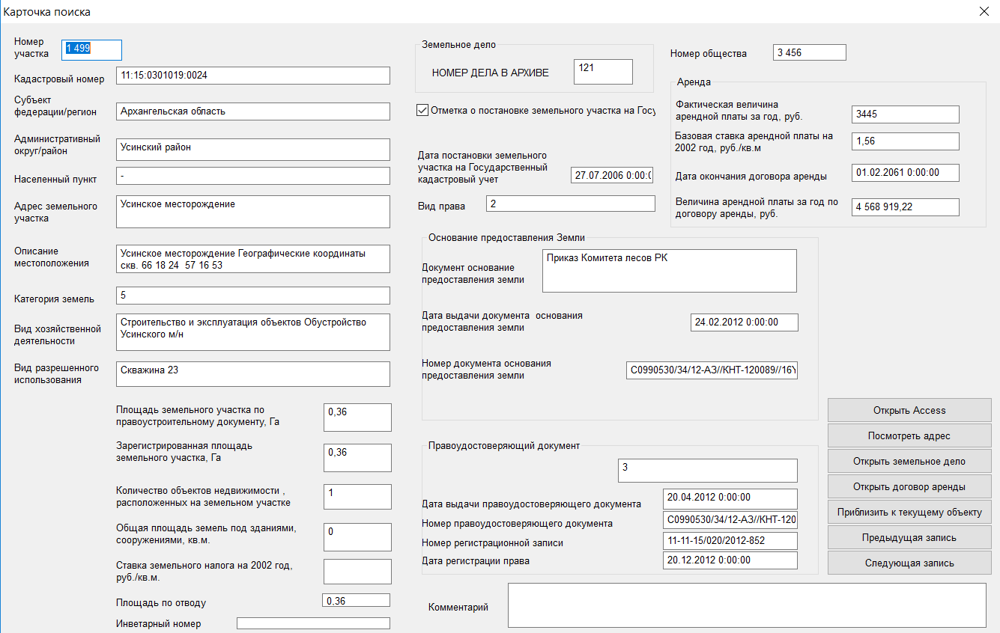

Работа с контекстным меню
================================================
Контекстное меню включает в себя три команды

    .. figure:: img/contextMenuCommand.png
        :align: center
        :name: Дополнительное контекстное меню
        :alt: Дополнительное контекстное меню

        Команды контекстного меню

.. _open-context-card:

Открыть карточку поиска
--------------------------------------------
С помощью этой команды можно открыть соотвествующую запись из базы Земля в виде формы

.. tip:: Если команда неактивна, то вы задали неправильный путь либо сознательно отключили работу с БД

По нажатию открывается следующая форма:

        Карточка выбранного объекта

Открыть договор аренды
-----------------------
С помощью этой команды можно найти папку договора, которая соотвествует выбранному объекту. Если папка не найдена, то появится сообщение об ошибке, что папка не найдена.

.. note:: Поиск папок рекурсивный. После выполнения операции будут открыты все папки, которые удовлетворяют условиям поиска (если условиям поиска удовлетворяют 2 папки -- откроется 2 папки, если 30  -- то 30)

Открыть земельное дело
-----------------------
С помощью этой команды можно найти папку с земельным делом, которая соотвествует выбранному объекту. Если папка не найдена, то появится сообщение об ошибке, что папка не найдена.
