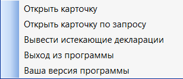

Работа с основым меню
================================================
Основное меню на панели инструментов содержит в себе следующие команды

.. _open-card-panel:
Открыть карточку
------------------------------------------------------------
Данная команда открывает карточку первой записи из БД Земля. 

    Команды основного меню

После нажатия открывается следующая форма, на которой содержатся основные характеристики первого по счету участка в БД Земля. 

.. figure:: img/firstRawCard.png
    :align: center
    :alt: Карточка по первой записи
    :name: Карточка по первой записи

    Карточка по первой записи

.. hint:: Изменения проведенные на этой форме не сохраняются в данных.

Основные команды сосредоточены в правом нижнем углу. Описание функций кнопок представлено ниже

Открыть Access
++++++++++++++
Открывает БД Земля (форму), на соотвествующей записи. На соотвествующем рисунке представлена открытая форма. 

    .. figure:: img/accessForm.png
        :align: center
        :alt: Карточка по первой записи
        :name: Карточка по первой записи

        Форма из БД Земля по первой записи

    .. attention:: Используйте эту форму для редактирования атрибутивных данных. При завершении изменения данных **НЕ ИСПОЛЬЗУЙТЕ** клавишу дискетки, а просто закрывайте программу Access c помощью кнопки закрыть в правом верхнем углу.
    .. tip:: Используйте эту функцию для просмотра дополнительных атрибутов (например, обременения или объектов недвижимости)

Посмотреть адрес
+++++++++++++++++
Открывает форму с информацией по местоположению участка, которая содержится в **графике (векторном слое)**. Представляет ее в виде небольшой формы   

    .. figure:: img/addressForm.png
        :align: center
        :alt: Форма адреса
        :name: Форма адреса
        :scale: 80%

        Форма с описанием адресоместоположения (адреса) объекта

    .. hint:: Изменения проведенные на этой форме не сохраняются в данных.

.. _openFolder:

Открыть земельное дело
++++++++++++++++++++++
Функция аналогична команде контекстного меню. С помощью этой команды можно найти папку с земельным делом, которая соотвествует текущей записи. Если папка не найдена, то появится сообщение об ошибке, что папка не найдена.

Открыть договор аренды
++++++++++++++++++++++
Функция аналогична команде контекстного меню.С помощью этой команды можно найти папку договора, которая соотвествует текущей записи. Если папка не найдена, то появится сообщение об ошибке, что папка не найдена.

.. note:: Поиск папок рекурсивный. После выполнения операции будут открыты все папки, которые удовлетворяют условиям поиска

.. _zoomToObject:

Приблизить к текущему объекту
+++++++++++++++++++++++++++++
При нажатии на эту кнопку окно карты приближается до графического объекта, который сейчас отображается на форме. 

.. warning:: Если для этой записи нет геометрии будет вызвана ошибка **"Нет объекта с таким ID"**

.. _navigation:

Предыдущая/Следующая запись
+++++++++++++++++++++++++++

Данные кнопки служат для навигации по записям. Возможны следюущие варианты:

    + Если карточка вызвана :ref:`из контекстного меню <open-context-card>`  или из :ref:`панели меню <open-card-panel>`, то навигация осуществляется по БД Земля
    + Если карточка поиска вызвана по запросу, то навигация происходит по **выбранным** записям

.. note:: Если карточка пустая, посмотрите эту :ref:`ссылку <emptyСard>` 

Открыть карточку по запросу
-----------------------------
Одна из основных команд программы, которая позволяет упростить формирование запросов SQL к БД Земля. Серым цветом на рисунке изображена область где отображается сформированный SQL запрос. Вы **не можете** редактировать его вручную, только с помощью различных команд во "вложенных" формах

    .. figure:: img/queryMenu.png
        :align: center
        :alt: Форма запроса
        :name: Форма запроса
        :scale: 80%

        Форма для запроса карточки по условиям

.. tip:: Для того, чтобы очистить окно запроса закройте его и откройте снова через панель меню.

Описание команд представлено ниже

Добавить условие по базе
++++++++++++++++++++++++
Эта кнопка используется для составления запросов по аттрибутам (полям), которые есть в БД Земля. 
При нажатии на эту кнопку появляется окно с возможностью выбрать поле для составления условия. 

    .. figure:: img/selectField.png
        :align: center
        :alt: Выбор поля для формирования запроса
        :name: Выбор поля для формирования запроса
        :scale: 80%

        Выбор поля для формирования запроса

За один раз можно выбрать только **одно** поле. Если вы хотите сформировать несколько условий необходимо будет повторить данную операцию необходимое число раз. Несколько примеров по составлению запросов вы можете найти :ref:`здесь <sample-selection>`. В данном диалоге вы **должны** выбрать поле или закрыть диалог. После выбора поля открывается диалог для подстановки значения выбранного поля и настройка необходимых операторов. Будем работать на примере поля ``Субъект_федерации``. После выбора соотвествующего поля открывается диалог. 

    .. figure:: img/addConditionBase.png
        :align: center
        :alt: Добавление условия по базе
        :name: Добавление условия по базе
        :scale: 80%

        Добавление условия по базе

На этом диалоге вы можете видеть 4 основных элемента и две кнопки. Их описание представлено ниже.

        + **Элемент №1** --Имя выбранного поля
        + **Элемент №2** -- Оператор взаимотношения поля и значения. Например, если я хочу выбрать все записи,у которых значения в поле ``Субъект_федерации`` "Архангельская область" я выбираю ``Равно``. Если -- все записи, где значение не Архангельская область то ``Не равно`` и т.д. 

            Список доступных операторов

            * ``Равно``
            * ``Не равно``
            * ``Больше``
            * ``Меньше``
            * ``Больше или равно``
            * ``Меньше или равно``

        + **Элемент №3** -- способ учета нескольких условий. При первом выборе условия -- не доступен. Описывает, как вы хотите соединить два условия. Например, если вы хотите выбрать все записи, где значение поля ``Субъект_федерации`` "Архангельская область", и у этого же участка значения поля ``ID`` равно 1499, то необходимо выбрать оператор ``И``. А если вы хотите выбрать все записи, которые находятся в Республике Коми и в Архангельской области, вам необходим оператор ``ИЛИ``.

            Список доступных операторов

            * ``И``
            * ``ИЛИ``

        + **Элемент №4** -- поле ввода значения. Есть два способа ввести значение в это поле. **Во-первых,** можно вручную  набрать в этой области. **Во-вторых,** использовать кнопку **Получить значения из поля**.
        + **Кнопка Получить значения из поля** -- Позволяет вставить в поле (Элемент №4) значение из самого поля. При нажатии на эту кнопку появляется окошко, в котором программа формирует список уникальных значений выбранного поля в алфавитном порядке. 

        .. figure:: img/selectUniqValue.png
            :align: center
            :alt: Выбор уникального значения
            :name: Выбор уникального значения
            :scale: 80%

            Выбор уникального значения

        В этом окне можно выбрать одно из значений и при нажатии на кнопку **ОК** оно вставится в поле ввода значения (Элемент №4)

        + **Кнопка Добавить условие** -- формирует фрагмент SQL - выражения и добавляет его к основному запросу. 

        .. figure:: img/sqlQuery.png
            :align: center
            :alt: Окно запроса, с сформированным SQL-выражением
            :name: Окно запроса, с сформированным SQL-выражением
            :scale: 80%

            Окно запроса, с сформированным SQL-выражением

Добавить условие по адресу
++++++++++++++++++++++++++
Данная команда позволяет найти участки по адресным или иным оринетирам, которые находятся в слое **графики**. При нажатии на кнопку вызывается следующий диалог. 

    .. figure:: img/selectAddress.png
        :align: center
        :alt: Окно добавления условия по адресу
        :name: Окно добавления условия по адресу
        :scale: 80%

        Окно добавления условия по адресу

Основные элементы помечены цифрами и стрелками. Их описание представлено ниже.

+ **Элементы №1** -- Операторы соотношения между полями поиска. Становится активным при нажатии на соответсвующий "квадратик". 

    Список доступных операторов

    * ``И``
    * ``ИЛИ``

    Данные операторы необходимы, если вы хотите выбрать, например, по лесничеству и по принадлежности к муниципальному району и т.п. Подробнее по составлению выражений смотрите :ref:`здесь <sample-selection>`. 

    .. warning:: Постарайтесь максимально конкретизировать запрос (из-за особенностей MapInfo)
    .. important:: Если вы не уверены -- не актививруйте эти операторы. По умолчанию используется оператор ``И``,который необходим в большинстве случаев.
    
    
+ **Элементы №2** -- Поля, который вы хотите использовать для составления запроса. Активирует поле для ввода значения (Элементы №3) при нажатии на соответсвующий "квадратик". Ниже представлена таблица, которая показывает соотвествие элемента, полю из графики.

    .. csv-table:: Соответствие элементов значениям полей 
        :header: "Название элемента", "Название поле из графики"
        :widths: 20, 20

        "Учитывать квартал", "Adress_N"
        "Учитывать участковое лесничество", "Adress_Ln"
        "Учитывать лесничество", "Adress_Lx"
        "Учитывать мун.район", "Adress_mr"

+ **Элементы №3** -- Поля для ввода значений. В эти поля можно заносить интересующее значение вручную или получив из соотвествующей колонки. Для этого необходимо нажать кнопку **"Из поля" (Элементы №4)**

    .. figure:: img/selectUniqValueAdress.png
        :align: center
        :alt: Окно добавления уникального значения
        :name: Окно добавления уникального значения
        :scale: 80%

        Окно добавления уникального значения

Программа построит уникальный список значений и предложит выбрать одно из значений, после чего запишет его в поле.

Кнопка **Добавить к запросу** формирует фрагмент SQL - выражения и добавляет его к основному запросу

    .. figure:: img/sqlQueryAdress.png
        :align: center
        :alt: Окно запроса, с сформированным SQL-выражением
        :name: Окно запроса, с сформированным SQL-выражением
        :scale: 80%

        Окно запроса, с сформированным SQL-выражением

Выполнить запрос
++++++++++++++++++++++++
Делает запрос по базе и открывает карточку поиска по выбранным записям. Если запрос не сформирован -- закрывает диалог. Если запрос сформирован выполняет его. 

.. note:: Если карточка пустая посмотрите :ref:`здесь <emptyСard>` 

Вывести истекающие декларации
-----------------------------
Эта функция позволяет вывести декларации (файл XLS указанный в параметрах), срок действия которых истекает через заданный срок. 

    .. figure:: img/endDecl.png
        :align: center
        :alt: Заканчивающиеся декларации
        :name: Заканчивающиеся декларации
        :scale: 80%

        Форма отбора заканчивающихся деклараций
По результатам выполнения появится и отобразится табличка *endDecl*, в которой будут содержатся все истекающие декларации

.. note:: Пока вы не выполнили новый запрос, табличка *endDecl* будет доступна 

Выход из программы
-----------------------------
Закрывает программу и все открытые таблицы

.. tip:: Если вы случайно выполнили эту операцию, вы можете либо перезапустить программу, открыв рабочий набор, либо вы можете использовать команду панели меню **Программы > Запустить программу MapBasic** и выбрать файл ``mainCode\Lukoil.MBX``

Ваша версия программы
-----------------------------
Вызывает окно, в котором написана текущая версия программы